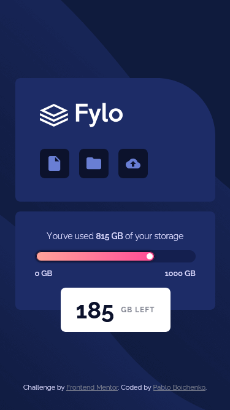
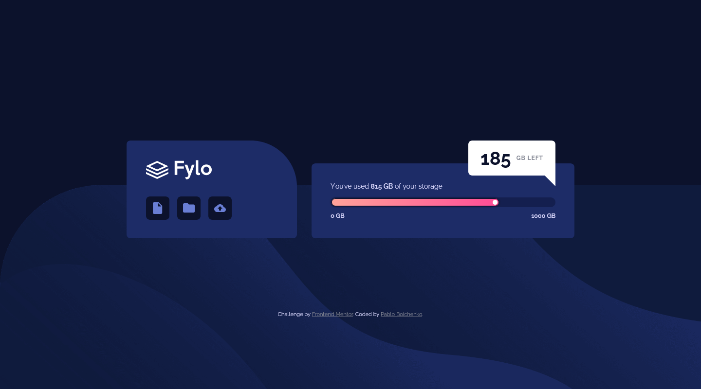

# Frontend Mentor - Fylo data storage component solution

This is a solution to the [Fylo data storage component challenge on Frontend Mentor](https://www.frontendmentor.io/challenges/fylo-data-storage-component-1dZPRbV5n). Frontend Mentor challenges help you improve your coding skills by building realistic projects. 

## Table of contents

- [Overview](#overview)
  - [The challenge](#the-challenge)
  - [Screenshot](#screenshot)
  - [Links](#links)
- [My process](#my-process)
  - [Built with](#built-with)
- [Author](#author)
- [Acknowledgments](#acknowledgments)

## Overview

### The challenge

Users should be able to:

- View the optimal layout for the site depending on their device's screen size

### Screenshot

 

### Links

- Solution URL: [https://github.com/PablinViking/Fylo-data-storage]

- Live Site URL: [https://pablinviking.github.io/Fylo-data-storage/]

## My process

### Built with

- Semantic HTML5 markup
- CSS custom properties
- Flexbox
- CSS Grid
- Mobile-first workflow
- [React](https://reactjs.org/) - JS library
- SASS
- BEM

## Author

Website - [https://github.com/PablinViking]

Frontend Mentor - [https://www.frontendmentor.io/profile/PablinViking]

Instagram - [https://www.instagram.com/pabloboichenko/]

## Acknowledgments

I want to thank my teacher David Ruiz. Without him, I wouldn’t be on this path.

David Ruiz - [https://www.youtube.com/@CodingTube]
